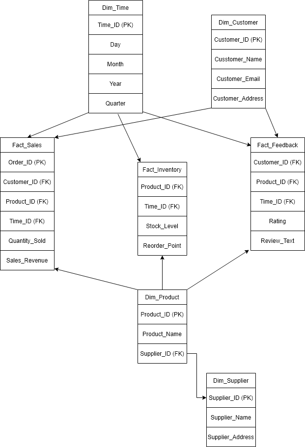

# E-Commerce Data Warehouse and ETL Pipeline

The data warehouse uses a star schema to support clear relationships between fact and dimension tables. This structure makes it easier to query sales, inventory, and feedback data across customers, products, suppliers, and time periods.

- **Fact tables:** `Fact_Sales`, `Fact_Feedback`, `Fact_Inventory`
- **Dimension tables:** `Dim_Customer`, `Dim_Product`, `Dim_Supplier`, `Dim_Time`

  <!-- Upload your diagram to the architecture folder and update the path if needed -->
  

## Tech Stack and Techniques

- **Database engine:** PostgreSQL

- **Data integration and ETL**
  - Extracted transactional data from relational database sources
  - Parsed semi-structured JSON data using `JSONB` extraction and casting
  - Imported CSV files using the PostgreSQL `COPY` command

- **SQL techniques**
  - Common Table Expressions (CTEs)
  - Window functions using `OVER()`
  - `CASE` statements
  - Joins across fact and dimension tables

## Analytical Queries

After the data was transformed and loaded, SQL queries were written to answer business-focused questions.

1. **Customer satisfaction trends**  
   Aggregated customer feedback and used window functions to calculate the percentage distribution of star ratings across the customer base.

2. **Inventory monitoring**  
   Joined inventory snapshots with sales data to identify products at `Critical` or `Warning` stock levels based on reorder points.

3. **Top-selling product analysis**  
   Ranked products by total sales volume and compared sales performance with customer feedback to calculate average sentiment ratings for high-performing products.
